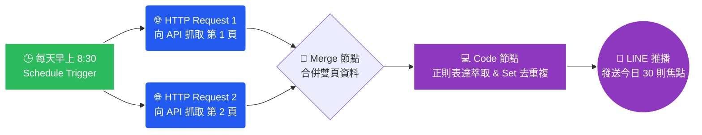

# 📈 n8n 自動化：經濟日報證券新聞機器人

這是一個透過 [n8n](https://n8n.io/) 自動化工作流打造的爬蟲專案。能每日定時向隱藏的 API 請求資料，將最新的證券焦點新聞整理並推播至個人的 LINE 官方帳號。

## 🌟 專案亮點技術
- **跨頁面平行抓取**：使用 n8n 的 `Merge` 節點同步發送多個 HTTP 請求，輕鬆抓取超過單頁限制的資料。
- **嚴謹的「雙重過濾去重複」機制**：
  因為原新聞網站在主子分類會混入不同追蹤碼（`?from=...`）導致網址不同，特地以自定義的 JavaScript 撰寫正則表達式，自動把追蹤碼切除，並利用 `Set` 特性同時過濾「網址」與「標題」，確保 100% 不重複推播。

## 🛠️ 使用 / 部署方式
1. 請下載本專案中的 `news crawler.json` 檔案。
2. 開啟你的 n8n 畫布，選擇從檔案匯入 (Import from File)。
3. 在最後一個發送給 LINE 的節點中，建立你的 `Header Auth`，並輸入 `Bearer [你的 LINE Channel Access Token]` 即可啟動排程。
